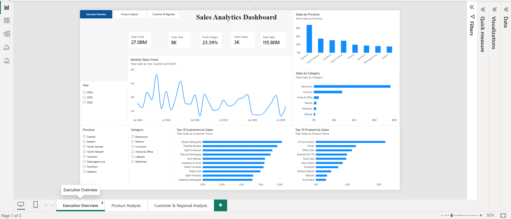
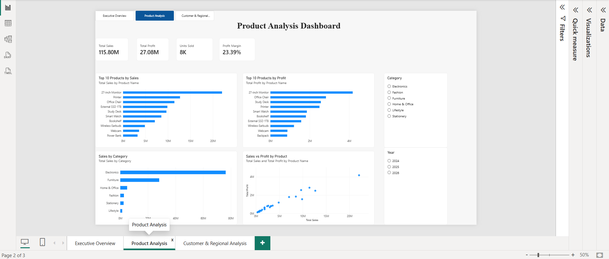
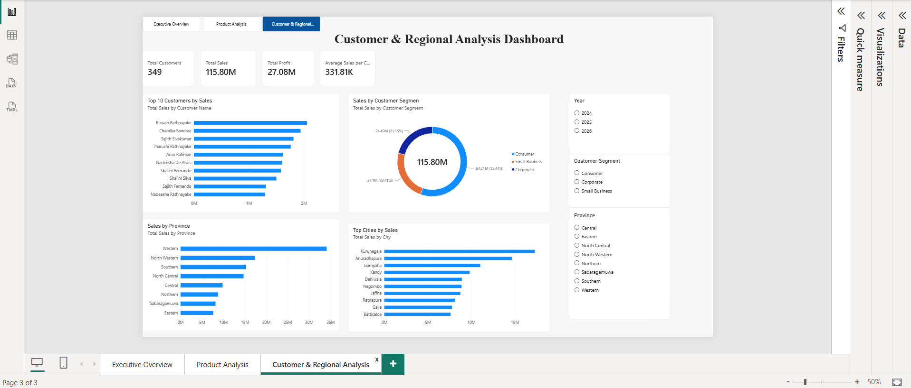

# 📊 Sales Analytics Dashboard – Power BI

**An interactive end-to-end Sales Analytics Dashboard built using Microsoft Power BI to analyze business performance, profitability, products, customers, regional trends, and time-based sales patterns.**

This project transforms raw sales data into **clear, interactive, and decision-ready business insights** using **Power Query, DAX measures, KPI cards, Top-N analysis, slicers, cross-filtering, and multi-page dashboard navigation**.

---

## 📌 Project Overview

The **Sales Analytics Dashboard** was designed to provide a complete view of sales performance across multiple business dimensions.

The dashboard focuses on:

- **Overall sales and profitability**
- **Product performance**
- **Customer performance**
- **Customer segmentation**
- **Regional and city-level sales**
- **Monthly sales trends**
- **Top-performing products and customers**
- **Interactive filtering and navigation**

The final report contains **three interactive dashboard pages**:

1. **Executive Overview**
2. **Product Analysis**
3. **Customer & Regional Analysis**

---

# 🖼️ Dashboard Preview

## 1️⃣ Executive Overview



The **Executive Overview** page provides a high-level summary of overall business performance.

### Key KPIs

- **Total Sales**
- **Total Profit**
- **Total Orders**
- **Units Sold**
- **Profit Margin**

### Main Visuals

- **Monthly Sales Trend**
- **Sales by Province**
- **Sales by Category**
- **Top 10 Customers by Sales**
- **Top 10 Products by Sales**

### Interactive Filters

- **Year**
- **Province**
- **Category**

---

## 2️⃣ Product Analysis



The **Product Analysis** page focuses on product-level sales performance and profitability.

### Key KPIs

- **Total Sales**
- **Total Profit**
- **Units Sold**
- **Profit Margin**

### Main Visuals

- **Top 10 Products by Sales**
- **Top 10 Products by Profit**
- **Sales by Category**
- **Sales vs Profit by Product**

### Interactive Filters

- **Category**
- **Year**

This page helps identify products that generate the **highest revenue**, products that generate the **highest profit**, and the relationship between **sales and profitability**.

---

## 3️⃣ Customer & Regional Analysis



The **Customer & Regional Analysis** page focuses on customer behaviour and geographical sales performance.

### Key KPIs

- **Total Customers**
- **Total Sales**
- **Total Profit**
- **Average Sales per Customer**

### Main Visuals

- **Top 10 Customers by Sales**
- **Sales by Customer Segment**
- **Sales by Province**
- **Top Cities by Sales**

### Interactive Filters

- **Year**
- **Province**
- **Customer Segment**

This page helps identify the **most valuable customers**, the strongest **customer segments**, and the best-performing **provinces and cities**.

---

# 📈 Key Dashboard Results

| **KPI** | **Result** |
|---|---:|
| **Total Sales** | **LKR 115.80M** |
| **Total Profit** | **LKR 27.08M** |
| **Profit Margin** | **23.39%** |
| **Total Orders** | **3K** |
| **Units Sold** | **8K** |
| **Total Customers** | **349** |
| **Average Sales per Customer** | **LKR 331.81K** |

> **Note:** KPI values are based on the current dataset and may change when filters are applied.

---

# 🧮 DAX Measures

The dashboard uses custom **DAX measures** to calculate important business KPIs.

## Total Sales

```DAX
Total Sales =
SUM(Raw_Sales_Data[Sales (LKR)])
```

## Total Profit

```DAX
Total Profit =
SUM(Raw_Sales_Data[Profit (LKR)])
```

## Total Orders

```DAX
Total Orders =
DISTINCTCOUNT(Raw_Sales_Data[Order ID])
```

## Units Sold

```DAX
Units Sold =
SUM(Raw_Sales_Data[Quantity])
```

## Profit Margin

```DAX
Profit Margin =
DIVIDE([Total Profit], [Total Sales], 0)
```

## Total Customers

```DAX
Total Customers =
DISTINCTCOUNT(Raw_Sales_Data[Customer ID])
```

## Average Sales per Customer

```DAX
Average Sales per Customer =
DIVIDE([Total Sales], [Total Customers], 0)
```

---

# 🔍 Key Business Insights

### Sales Performance

- Tracks **total sales** and **monthly sales movement**.
- Helps identify periods of stronger and weaker sales performance.
- Supports **year-based filtering** for time comparisons.

### Profitability

- Measures **total profit** and **overall profit margin**.
- Compares product-level sales with product-level profit.
- Helps identify high-revenue products that also generate strong profit.

### Product Performance

- Ranks the **Top 10 Products by Sales**.
- Ranks the **Top 10 Products by Profit**.
- Compares sales performance across **product categories**.
- Uses a scatter chart to examine the relationship between **sales and profit**.

### Customer Analysis

- Identifies the **Top 10 Customers by Sales**.
- Measures the number of **unique customers**.
- Calculates **Average Sales per Customer**.
- Analyzes customer contribution by **customer segment**.

### Regional Analysis

- Compares sales across **provinces**.
- Identifies the **top-performing cities**.
- Allows province-level filtering for deeper analysis.

---

# ❓ Business Questions Answered

This dashboard helps answer questions such as:

- **How much total revenue has the business generated?**
- **How much profit has the business earned?**
- **What is the overall profit margin?**
- **How many orders have been placed?**
- **How many units have been sold?**
- **How many unique customers are in the dataset?**
- **What is the average sales value per customer?**
- **How are sales changing over time?**
- **Which products generate the highest sales?**
- **Which products generate the highest profit?**
- **Which product categories contribute the most revenue?**
- **Which customers contribute the most sales?**
- **Which customer segment contributes the most revenue?**
- **Which provinces perform best?**
- **Which cities generate the highest sales?**
- **What is the relationship between product sales and profit?**

---

# ✨ Dashboard Features

- **Interactive Power BI dashboard**
- **Three analytical report pages**
- **Custom DAX measures**
- **KPI cards**
- **Top-N filtering**
- **Product profitability analysis**
- **Customer analysis**
- **Customer segmentation**
- **Regional analysis**
- **Monthly trend analysis**
- **Interactive slicers**
- **Cross-filtering between visuals**
- **Page navigation buttons**
- **Sales vs Profit scatter analysis**
- **Responsive visual interactions**
- **Clean and professional report layout**

---

# 🛠️ Tools & Technologies

- **Microsoft Power BI Desktop**
- **Power Query**
- **DAX**
- **Data Cleaning**
- **Data Transformation**
- **Data Analysis**
- **Data Visualization**
- **Git**
- **GitHub**

---

# 📂 Project Structure

```text
sales-analytics-powerbi/
│
├── dashboard/
│   └── Sales_Analytics_Dashboard.pbix
│
├── screenshots/
│   ├── 01_Executive_Overview.png
│   ├── 02_Product_Analysis.png
│   └── 03_Customer_Regional_Analysis.png
│
├── data/
│
└── README.md
```

---

# ▶️ How to Use the Dashboard

1. **Clone or download** this repository.
2. Open the `dashboard` folder.
3. Open **`Sales_Analytics_Dashboard.pbix`** using **Microsoft Power BI Desktop**.
4. Use the **page navigation buttons** to move between dashboard pages.
5. Use the available **Year, Province, Category, and Customer Segment slicers** to filter the report.
6. Click individual charts or data points to **cross-filter other visuals**.
7. Use the Top-N charts to identify the strongest-performing products, customers, cities, and regions.

---

# 🧠 Skills Demonstrated

This project demonstrates practical skills in:

- **Business Intelligence**
- **Power BI dashboard development**
- **Power Query transformations**
- **DAX measure creation**
- **KPI development**
- **Data visualization**
- **Interactive report design**
- **Time-series analysis**
- **Product analysis**
- **Customer analytics**
- **Regional analytics**
- **Business insight generation**
- **GitHub project documentation**

---

# 🔐 Data Privacy

Before publishing the dataset publicly, ensure that it does not contain **private, confidential, or personally sensitive customer information**.

If the raw dataset contains sensitive data, keep it out of the public repository and include only the Power BI report, screenshots, and documentation.

---

# 🚀 Future Improvements

Possible future enhancements include:

- **Sales forecasting**
- **Year-over-year growth analysis**
- **Month-over-month growth analysis**
- **Dynamic KPI comparison**
- **Target vs Actual analysis**
- **Advanced drill-through pages**
- **Tooltip pages**
- **Customer lifetime value analysis**
- **RFM customer segmentation**
- **Geographical map visualization**
- **Automated data refresh**
- **Power BI Service publishing**

---

# 👨‍💻 Author

**Balakrishnan Premnath**

**BSc (Hons) in Data Science**  
**Sri Lanka Technology Campus (SLTC)**

**Focus Areas:** Data Analytics, Machine Learning, Artificial Intelligence, Data Visualization, and Business Intelligence.

---

# ✅ Project Status

**Completed**

The dashboard includes:

- **Executive Overview**
- **Product Analysis**
- **Customer & Regional Analysis**
- **Interactive slicers**
- **Custom DAX measures**
- **Page navigation**
- **Top-N analysis**
- **Product, customer, and regional insights**

---

## ⭐ If you find this project useful

Feel free to **star the repository** and explore the dashboard screenshots and Power BI report.
